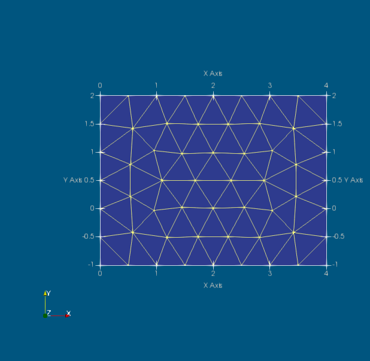
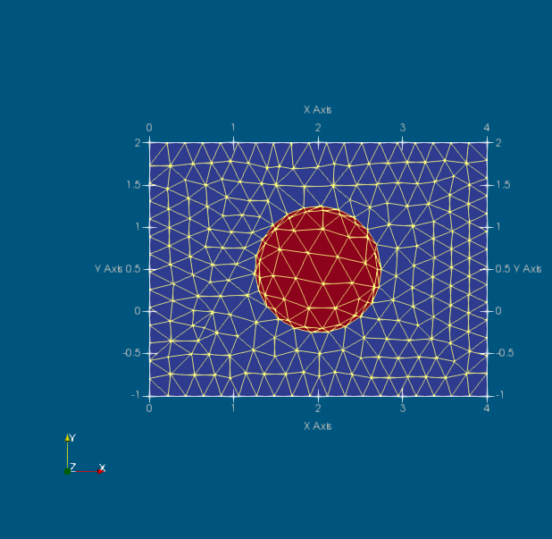
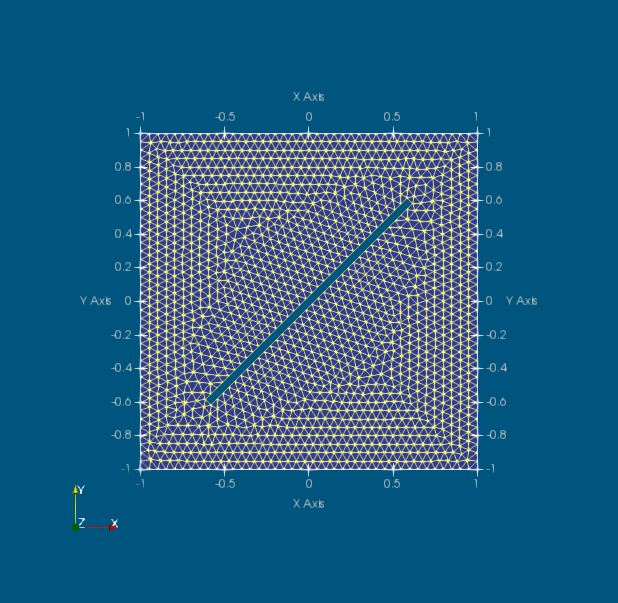

# Gallery of Targe2 meshes

The examples here assume that you have the `Targe2` package and its dependencies installed. Furthermore you need the present package,
`Targe2Showroom` and its dependencies. Also, the visualization software `Paraview` (http://www.paraview.org/) needs to be installed in order to visualize the meshes.

First execute these two lines:
```
using Targe2 
using Targe2Showroom: demo
```

## Coarse mesh of a rectangle

A really simple example is this uniform mesh of a rectangle. Select this code and execute in Julia. You should get a picture like the one below.
```
demo("rectangle-uniform", """
curve 1 line 0 -1 4 -1
curve 2 line 4 -1  4 2 
curve 3 line 4 2  0 2  
curve 4 line 0 2  0 -1
subregion 1  property 1 boundary 1 2 3 4
m-ctl-point constant 2.5
""", show = true);
```

The key is to realize that each subregion needs to be circumscribed with edges that are traversed counterclockwise. Each line segment has an orientation given by the order in which its endpoints are listed. Since all line curves are given so that they are traversed counterclockwise in their positive sense, the boundary consists of the list of the curves with positive signs (`1 2 3 4`).

If we assign the result of the `demo` call to the variable `mesh` as
```
mesh = demo("rectangle-uniform", """
curve 1 line 0 -1 4 -1
curve 2 line 4 -1  4 2 
curve 3 line 4 2  0 2  
curve 4 line 0 2  0 -1
subregion 1  property 1 boundary 1 2 3 4
m-ctl-point constant 2.5
""", show = true);
```
we receive the `mesh` data structure (named tuple). The data structure looks like this:
```
julia> mesh
(xy = [0.0 -1.0; 2.0 -1.0; … ; 2.0 2.0; 0.0 2.0], triconn = [1 2 6; 2 3 4; 4 5 2; 5 6 2], trigroups = Array{Int64,1}[[1, 2, 3, 4]], edgeconn = [1 2; 2 3; … ; 2 4; 2 5], edgegroups = Array{Int64,1}[[1, 2], [3], [4, 5], [6]]) 
```
There is only a single group of triangles (i. e. a single subregion, per the specifications), and for each edge (curve) there is one group of edges. The connectivity array point into the array of vertex coordinates, `mesh.xy`.

## Finer mesh on a rectangle

To refine the mesh is easy: we will define the "constant" (uniform) element size to be smaller.
```
demo("rectangle-uniform-finer", """
curve 1 line 0 -1 4 -1
curve 2 line 4 -1  4 2 
curve 3 line 4 2  0 2  
curve 4 line 0 2  0 -1
subregion 1  property 1 boundary 1 2 3 4
m-ctl-point constant 0.5
""", show = true);
```


## Mesh of a rectangle with a circular hole

We will introduce a hole in the middle of the rectangle, of circular shape and radius 0.75. We will also make the elements smaller with a factor of two.
```
demo("rectangle-uniform-hole", """
curve 1 line 0 -1 4 -1
curve 2 line 4 -1  4 2 
curve 3 line 4 2  0 2  
curve 4 line 0 2  0 -1
curve 5 circle center 2 $((2 + -1)/2.0) radius 0.75
subregion 1  property 1 boundary 1 2 3 4 hole -5
m-ctl-point constant 0.25
""", show = true);
```

Note that the hole is made by referring to the boundary of the circle with a negative sign. The boundary of a hole needs to be traversed clockwise. The circular curve is by convention positive when it is traversed in the counterclockwise direction, so in order to create a hole we need to list it with a negative sign (`-5`).

## Mesh of a rectangle with a filled circular subregion

Now we will fill the hole with a second subregion.
```
demo("rectangle-uniform-2", """
curve 1 line 0 -1 4 -1
curve 2 line 4 -1  4 2 
curve 3 line 4 2  0 2  
curve 4 line 0 2  0 -1
curve 5 circle center 2 $((2 + -1)/2.0) radius 0.75
subregion 1  property 1 boundary 1 2 3 4 hole -5
subregion 2  property 2 boundary 5
m-ctl-point constant 0.25
""", show = true);
```

Note that the circle curve (`5`) is used twice: once with a negative sign to define a hole in the first subregion, and once with a positive sign to define the second subregion which fills the hole in the first subregion.

## Mesh of three subregions

In this example we can add a third subregion to the left of the first subregion. We add three line curves, but note that in order to traverse the boundary of the third subregion counterclockwise, we need to refer to some of these curves with a negative identifier. The previously defined curve `4` is reused for the definition of subregion 3, and in this case it needs to be referenced as `-4`.
```
demo("rectangle-uniform-3", """
curve 1 line 0 -1 4 -1
curve 2 line 4 -1  4 2 
curve 3 line 4 2  0 2  
curve 4 line 0 2  0 -1
curve 5 circle center 2 $((2 + -1)/2.0) radius 0.75
curve 11 line 0 -1 -1 -1
curve 12 line -1 -1 -1 2
curve 23 line 0 2 -1 2
subregion 1  property 1 boundary 1 2 3 4 hole -5
subregion 2  property 2 boundary 5
subregion 3  property 3 boundary -12 -11 23 -4
m-ctl-point constant 0.25
""", show = true);
```

The colors obviously refer to the numerical identifiers of the subregions (call for the color legend in the figure). Also we may note here that the numbering of the curves is arbitrary as long as the identifiers of the curves are unique.

## Mesh of two regions with nodes on a given curve

We can enforce the location of nodes on some curves. For instance here we enforce the presence of an additional circle inside the circular subregion 2. And we also enforce the presence of an inclined straight line in subregion 1. This is accomplished by embedding a curve inside the domain with both the positive and negative orientation. In this way the curve is incorporated in the domain triangulation: there is no crack, the triangulation is continuous along the curve from both sides. 
```
demo("rectangle-uniform-2-c", """
curve 1 line 0 -1 4 -1
curve 2 line 4 -1  4 2 
curve 3 line 4 2  0 2  
curve 4 line 0 2  0 -1
curve 5 circle center 2 $((2 + -1)/2.0) radius 0.75
curve 7 circle center 2 $((2 + -1)/2.0) radius 0.7
curve 40 line 0.5 -0.5  1.5 1.5
subregion 1  property 1 boundary 1 2 3 4 40 -40 hole -5
subregion 2  property 2 boundary 5 7 -7
m-ctl-point constant 0.21
""", show = true);
```



## Graded mesh of a rectangle with a filled circular subregion

Now we will fill the hole with a second subregion.
```
demo("rectangle-graded-2", """
curve 1 line 0 -1 4 -1
curve 2 line 4 -1  4 2 
curve 3 line 4 2  0 2  
curve 4 line 0 2  0 -1
curve 5 circle center 2 $((2 + -1)/2.0) radius 0.75
subregion 1  property 1 boundary 1 2 3 4 hole -5
subregion 2  property 2 boundary 5
m-ctl-point 1 xy 2 $((2 + -1)/2.0) near 0.05 influence 0.15
m-ctl-point constant 3
""", show = true);
```


## Mesh of region with a slit


```
demo("rectangle-uniform-slit", """
curve 1 line 0 -1 4 -1
curve 2 line 4 -1  4 2 
curve 3 line 4 2  0 2  
curve 4 line 0 2  0 -1
curve 40 line  1 0 2 0.501
curve 41 line  2 0.501 3. 1. 
curve 42 line  3. 1.  2 0.499
curve 43 line  2 0.499 1 0
subregion 1  property 1 boundary 1 2 3 4 hole 40 41 42 43
m-ctl-point constant 0.31
""", show = true);
```


## Mesh of region with a Rounded slit


```
a, b, w = 1.0, 0.6, 0.025
cb, sw = b * 0.999, sqrt(2.0)/2 * w
demo("rectangle-uniform-rounded-slit", """
curve 1 line $(-a) $(-a) $(+a) $(-a)
curve 2 line $(+a) $(-a) $(+a) $(+a)
curve 3 line $(+a) $(+a) $(-a) $(+a)
curve 4 line $(-a) $(+a) $(-a) $(-a)
curve 40 arc $(-b+sw) $(-b-sw) $(-b-sw) $(-b+sw) center $(-cb) $(-cb) 
curve 41 arc $(+b-sw) $(+b+sw) $(+b+sw) $(+b-sw) center $(+cb) $(+cb) 
curve 42 line $(+b+sw) $(+b-sw) $(-b+sw) $(-b-sw)
curve 43 line $(-b-sw) $(-b+sw) $(+b-sw) $(+b+sw)
subregion 1  property 1 boundary 1 2 3 4 hole 40 41 42 43
m-ctl-point constant 0.05
""", show = true);
```


## Graded mesh of region with a Rounded slit


```
a, b, w = 1.0, 0.6, 0.025
cb, sw = b * 0.999, sqrt(2.0)/2 * w
demo("rectangle-graded-rounded-slit", """
curve 1 line $(-a) $(-a) $(+a) $(-a)
curve 2 line $(+a) $(-a) $(+a) $(+a)
curve 3 line $(+a) $(+a) $(-a) $(+a)
curve 4 line $(-a) $(+a) $(-a) $(-a)
curve 40 arc $(-b+sw) $(-b-sw) $(-b-sw) $(-b+sw) center $(-cb) $(-cb) 
curve 41 arc $(+b-sw) $(+b+sw) $(+b+sw) $(+b-sw) center $(+cb) $(+cb) 
curve 42 line $(+b+sw) $(+b-sw) $(-b+sw) $(-b-sw)
curve 43 line $(-b-sw) $(-b+sw) $(+b-sw) $(+b+sw)
subregion 1  property 1 boundary 1 2 3 4 hole 40 41 42 43
m-ctl-point constant $(a/2)
m-ctl-point 1 xy $(-cb) $(-cb) near $(w/5) influence $(w)
m-ctl-point 2 xy $(+cb) $(+cb) near $(w/5) influence $(w)
""", show = true);
```
